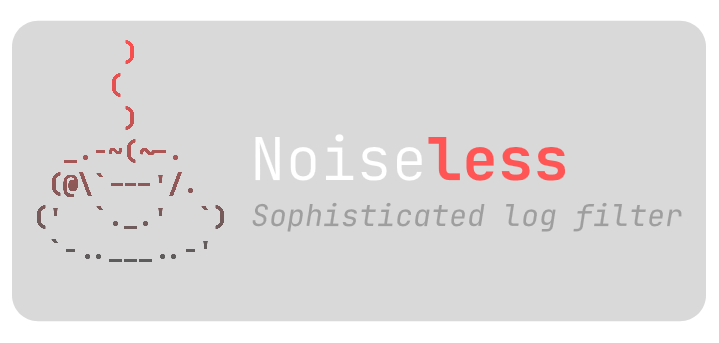

<div align="center">

  

  [](https://en.wikipedia.org/wiki/Python_(programming_language))
  []()

</div>

# Idea
Logs sometimes go massive and sometimes you don't have ElasticSearch or Grafana Loki nearby to look for something in those logs. Found myself in such spot, so I made a small CLI based tool to filter log files.

The usage boils down to filter one big .log file and remove all lines that didn't match with the keyword based filter.

> [!NOTE]  
> It doesn't support regex for now, you can only search for a specific keyword

It uses multiprocessing and will try to make it as fast as possible using as much workers as your CPU allows, generating a small report and filtered log file at the end.

# Installation

Clone the project:
```bash
git clone git@github.com:aASDa213ASD/noiseless.git
cd noiseless/
```

Make yourself a virtual environment:
```bash
python -m venv .env/

# Activate your environment by running
source .env/bin/activate  # for Linux

.env\Scripts\activate.bat # for Windows
```

Install requirements:
```bash
pip install -r requirements.txt
```

Put your log files and json filters in corresponding folders under [data/ directory](/data/).

Run the application:
```bash
python run.py
```